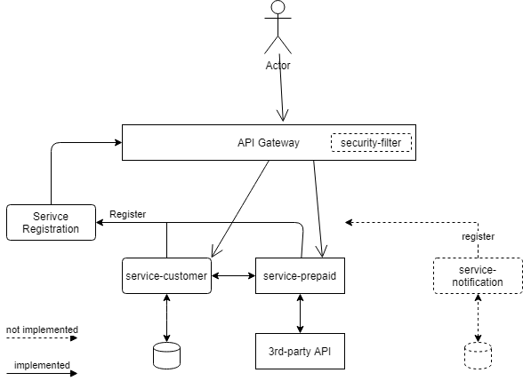
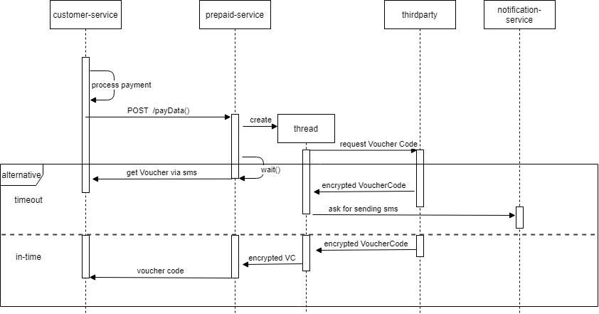

# Project Overview 
 
### Requirement
You need to install :
- JDK 8
- Maven 3.6

Architecture
============================

Components
============================

    .
    ├── ...
    ├── gateway                 # API gateway - Netflix Zuul
    ├── service-config          # Cloud configuration - Spring Cloud Config
    ├── service-customer        # Customer service - handling customer process - JPA,H2
    ├── service-discovery       # Service registration - Netflix Eureka  
    ├── service-prepaid-data    # Thirdparty Client - Spring Security - OpenFeign -retrofit2
    ├── telecom                 # Thirdparty  - Spring Security
    ├── build                   # Release folder
    └── ...

Workflow
============================

## Run
In /build folder run in order:

     java -jar service-discovery-0.0.1-SNAPSHOT.jar
     java -jar service-customer-0.0.1-SNAPSHOT.jar
     java -jar service-prepaid-data-0.0.1-SNAPSHOT.jar
     java -jar telecom-0.0.1-SNAPSHOT.jar
     java -jar gateway-0.0.1-SNAPSHOT.jar

## Testing
Import NAB.postman_collection.json into POSTMAN and start testing.

