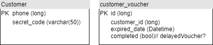

# NAB Customer Service

Process the user request. Create - Retrieve user information 
## Requirement
You need to install :
- JDK 8
- Maven 3.6

## Build

    mvn clean install
    
## Run

    mvn spring-boot:run

Folder Structure Conventions
============================
### A Source directory layout

    .
    ├── ...
    ├── com.thinhnguyen.nab.service.customer
    │   ├── client          # Feign HTTP client. Used for calling internal service
    │   ├── config          # Additional configuration
    │   ├── controller      # Rest controllers
    │   ├── dto             # DTO
    │   ├── repository      # Jpa repository 
    │   ├── exception       # Exception definination - handler
    │   └── service         # Business Logic 
    └── ...
    
## Database

### Data Migration: liquibase
TBD
